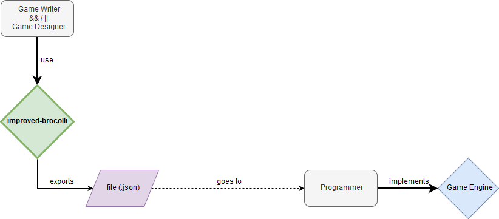

# Broccoli

**Broccoli** aims to be a tool that serves as a bridge between game writers and game programmers



The game writers will use the software, writing their item descriptions (or dialogues, or whatever needs text) and categorize each line as appropriate. Saving that project will create a file (.json) with a dictionary containing the text needed to implement in such a way that is easy for the programmer to later access in the game engine.

This will make it so that it's not necessarry to hardcode each line of text in the game engine's scripts, nor to spend team time  converting the text from the game writers to a format that can be used in a game engine.

Besides, the hability of the game writers to categorize each item of text will make it easier for the programmers to understand where each text should be applied.

<hr>

## How to use Broccoli?
_**For the writters**_
<br>
You can use **Broccoli** clicking [right here](https://josemachado-dev.github.io/)!

> More documentation to be added soon

<br>

_**For the programmers:** How to use Broccoli with your game engine?_
<br>
Currently, the only game engine supported is [Unity](https://unity.com/).
<br>
Please take a look at our [How to use Broccoli with Unity?](https://github.com/josemachado-dev/improved-broccoli/blob/master/Unity_Integration/Broccoli_UnityIntegration_README.md) file, in the [Unity_Integration folder](https://github.com/josemachado-dev/improved-broccoli/tree/master/Unity_Integration), for a better understanding at how to use it.


This, however, doesn't mean you can't use **Broccoli** with other game engines!
If you find a way to extract information from .json files to other game engines, **Broccoli** will be of use to you too. It does mean, however, that you'll have to do some extra work... Sorry!
> More game engines supported, soon to come!

<hr>

## How to install Broccoli

Start by clonning this repository, and instaling [Node.js](https://nodejs.org/en/).

Then, run your terminal (for example, in your code editor, like [Visual Studio Code](https://code.visualstudio.com/) ) and navigate to the folder where you've clonned the repository, and open the 'broccoli' folder
```
cd [Path_To_Repository]\broccoli
```
and then run
```
npm install -g @angular/cli
npm install
```
<br><br>
After that, whenever you want to run **Broccoli**, open a terminal, navigate to the `broccoli` folder, and run
```
ng serve -o
```

<hr>

## Contributing

Please read [CONTRIBUTING.md](CONTRIBUTING.md) for details on our code of conduct, and the process for submitting pull requests.

## License
This project is licensed under the  LGPL-3.0 License - see the [LICENSE](LICENSE) file for details
