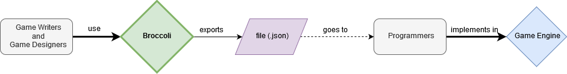

# improved-broccoli
improved-broccoli aims to be a tool that serves as a bridge between game writers and game programmers

The game writers will use the software, writing their item descriptions (or dialogues, or whatever needs text) and categorize each line as appropriate. Saving that project will create a file (.json) with a dictionary containing the text needed to implement in such a way that is easy for the programmer to later access in the game engine.

This will make it so that it's not necessarry to hardcode each line of text in the game engine's scripts, nor to spend team time  converting the text from the game writers to a format that can be used in a game engine.

Besides, the hability of the game writers to categorize each item of text will make it easier for the programmers to understand where each text should be applied.
